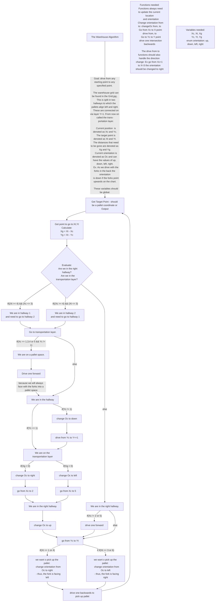

```mermaid

flowchart TB
    A[The Warehouse Algorithm] --Goal: drive from any starting point to any specified point. 

    The warehouse grid can be found in the Grid.jpg .
    This is split in two hallways to which the pallets align left and right.
    These are connected on via layer Y=1. From now on called the trans-
    portation layer. 

    Current position  is denoted as Xc and Yc.
    The target point is denoted as Xt and Yt.
    The distances that need to be gone are denoted as Xg and Yg.
    Current orientation is denoted as Oc and can have the values of up, down, left, right.
    Ex. As we drive with the forks in the back the orientation
    is down if the forks point upwards on the chart.

    These variables should be global.
    -->
    AA[Get Target Point - should be a pallet coordinate or Output]

    -->  B[Get point to go to:Xt,Yt
    Calculate:
     Xg = Xt - Xc
     Yg = Xt - Yc
     ] 

    B --> C{Evaluate:
    Are we in the right hallway?
    Are we in the transportation layer?
    }
    
    C -- if((Xt >= 4) && (Xc <= 3) --> E[We are in hallway 1
     and need to go to hallway 2] -->H
    C -- if((Xc >= 4) && (Xt <= 3) --> F[We are in hallway 2
     and need to go to hallway 1] --> H[Go to transportation layer.]

    H -- if(Xc == 1,3,4 or 5 && Yc != 1) --> J[We are on a pallet space.] --> JJ[Drive one forward] -- because we will always face with the forks into a pallet space -->K 
    H -- else --> K[We are in the hallway] -- if(Yc != 1) --> L[change Oc to down] 
    K -- if(Yc == 1) --> O[We are on the transportation layer]
    L --> T[drive from Yc to Y==1] --> O
    O -- if(Xg > 0) --> P[change Oc to right] --> S[go from Xc to 2] --> R[We are in the right hallway]
    O -- if(Xg < 0) --> Q[change Oc to left] --> U[go from Xc to 5] --> R

    R --> V[change Oc to up] --> W[go from Yc to Yt]
    -- if(Xt == 1 or 4) 
    --> X[we want o pick up the pallet: 
    change orientation from Oc to right
    - thus, the fork is facing left] --> Y[drive one backwards to pick up pallet]

    W -- if if(Xt == 3 or 6) --> XX[we want o pick up the pallet: 
    change orientation from Oc to left
    - thus, the fork is facing right] --> Y --> AA
    C -- else --> G[We are in the right hallway.] -- if(Xc != 2 or 5) --> WW[drive one forward]--> W
    G -- else --> W

    Func[
    Functions needed:
    Functions always need to update the current location
    and orientation
    Change orientation from to: changeOc from, to
    Go from Xc to X-point: drive from, to
    Go to Yc to Y point
    drive one intersection backwards

    The drive from to functions should also handle the direction change: Ex go from Xc=1 to X=3 the orientation should be changed to right
    ]
    Var[
    Variables needed:
    Xc, Xt, Xg
    Yc, Yt, Yg
        enum orientation: up, down, left, right
    ]

```